<div align="center">



[](https://git.io/typing-svg)

<p>
  
  
  
</p>

</div>

---

## 👋 whoami

I'm a **tinkerer** — the kind of person who sees a settings file, a locked-down console, or a UI I didn't design and thinks *"okay, but what if I opened this up."* Coding, modding, reverse-engineering, reflashing, rebuilding. I don't stick to one platform or one language; I go wherever the interesting problem is, which lately has meant **C on a console that says no**, **JavaScript on that same console**, and **a web app that takes dinner orders**.

```
whoami
> Aramaki — builder of tools nobody asked for but everyone ends up using
interests
> coding · modding · hacking · homebrew · reverse engineering · "let's see what's inside"
rule
> if my tool claims to preview what the console does, it runs the console's own arithmetic
```

---

## ⚡ Now Building

<div align="center">

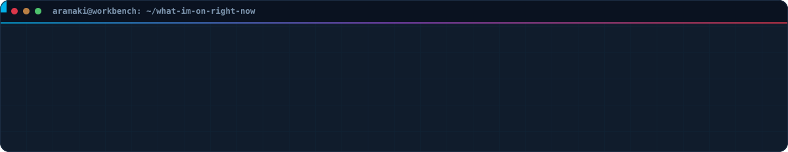

</div>

---

## 🧩 How It All Fits Together

The A-Theme project is one pipeline with two theme formats at the end of it — author a theme in the editor, publish it to a database, read it back on the console. Every arrow below is a code path that actually ships:

<div align="center">

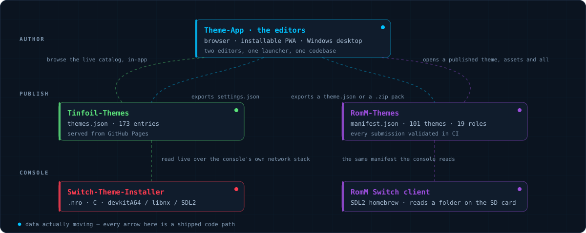

</div>

---

## 🛠️ The Projects

<table>
<tr>
<td width="50%">

[](https://github.com/A-Theme/Theme-App)

[](https://github.com/A-Theme/Theme-App/stargazers)
[](https://github.com/A-Theme/Theme-App/releases)

</td>
<td width="50%">

[](https://github.com/A-Theme/Switch-Theme-Installer)

[](https://github.com/A-Theme/Switch-Theme-Installer/stargazers)
[](https://github.com/A-Theme/Switch-Theme-Installer)

</td>
</tr>
<tr>
<td width="50%">

[](https://github.com/A-Theme/switch-rom-forwarder)

[](https://github.com/A-Theme/switch-rom-forwarder/stargazers)
[](https://github.com/A-Theme/switch-rom-forwarder)

</td>
<td width="50%">

[](https://github.com/A-Theme/RomM-Themes)

[](https://github.com/A-Theme/RomM-Themes/blob/main/manifest.json)
[](https://github.com/A-Theme/RomM-Themes/actions/workflows/validate.yml)

</td>
</tr>
<tr>
<td width="50%">

[](https://github.com/A-Theme/Tinfoil-Themes)

[](https://github.com/A-Theme/Tinfoil-Themes/stargazers)
[](https://github.com/A-Theme/Tinfoil-Themes)

</td>
<td width="50%">

[](https://github.com/A-Theme/dinner-by-derek)

[](https://github.com/A-Theme/dinner-by-derek)
[](https://github.com/A-Theme/dinner-by-derek)

</td>
</tr>
</table>

### 🖥️ [Theme-App](https://github.com/A-Theme/Theme-App) — the visual editors

**Two** editors now, one per theming target, sharing a launcher and the same scaffolding — and both run as a browser app, an installable PWA, *and* a Windows desktop build the release workflow cuts from `CHANGELOG.md` on every tag.

On the **Tinfoil** side:

- **Browse the entire live theme database from inside the app** and load one with a click — it downloads and unzips the archive **entirely client-side** (real embedded JSZip, no server involved) and wires up every bundled logo, background and audio file automatically
- **Palette generation via real k-means colour clustering**, extracted straight from your background image — not a gimmick, actual dominant-colour maths
- **A pixel-accurate mockup preview** of the real Tinfoil layout where every visible piece is hoverable: hover a selection tile and it names the JSON field that controls it; click it and the form scrolls there and highlights it
- Full alpha/transparency support with a visual slider and diagram, because hex colour formats are not intuitive and I got tired of explaining them

On the **RomM** side:

- **Browse the published catalog from inside the editor** — it reads the same `manifest.json` the console reads, and opens a theme with its background, font, mascot and music downloaded, so the quickest way to start is to open the nearest existing theme and change it. The URL handling deliberately mirrors the client's own `theme_catalog.cpp`, percent-encoding byte for byte
- **Background motion that actually plays** — `drift`/`pan`/`zoom` and sprite-sheet animation, previewed by a *port of the client's own `theme_motion.cpp`* rather than something that merely looks like drift. A differential test runs **6336 inputs through both implementations and requires byte-identical output**; it earned its keep immediately, catching that the console computes in 32-bit float where the first port was a whole pixel off at some timestamps
- **Import a folder, a `.zip` pack, or a bare `theme.json`** — a `theme.json` only *names* its background, so importing one file used to hand you colours and five dangling references
- **20 starting palettes**, each setting all 19 roles and contrast-checked on the pairs that actually break a theme: body text over all three surfaces, muted text, the focus ring, and whatever sits on an accent fill

### 🎮 [Switch-Theme-Installer](https://github.com/A-Theme/Switch-Theme-Installer) — native homebrew, on the console itself

The one I'm most proud of. A native C application (`.nro`) that runs *directly on a Nintendo Switch* — no PC required:

- Reads the theme database live over the Switch's own networking stack, browsable with a controller
- Real device rendering via SDL2 — an actual on-screen preview of a theme's colours and layout before you commit to installing it
- **Runs the same k-means palette extraction as the browser app, but on-device** — reads raw pixels out of a decoded image on the Switch itself and rewrites the theme's JSON in place, byte-for-byte, no serializer needed
- Built the hard way: real devkitA64/libnx toolchain, zip extraction via `zziplib`, JSON parsing via a hand-verified `jsmn` integration, and multiple real hardware test-and-fix cycles until it ran clean

### 🕹️ [switch-rom-forwarder](https://github.com/A-Theme/switch-rom-forwarder) — *new* — forwarders built on-device

HOME-menu forwarders for retro games, generated **on the console**, with no PC in the loop. Point it at a folder of ROMs or a shop index, pick a game, and it resolves the title, fetches box art, and builds the NSP.

- **Written in JavaScript — on a Switch.** It runs on [nx.js](https://nxjs.n8.io), so Node is the only toolchain requirement: no devkitPro, no MSYS2
- **Title resolution that survives bad filenames** — NACP first (authoritative), then **CRC32 against No-Intro/Redump DATs**, then filename cleanup. That's what rescues a file called `SLUS-01234` or named after its own checksum, and the resolved name is always editable before it's written
- **It checks forwarders other people made.** A forwarder built on someone else's system points at paths that don't exist on yours, and the failure mode is a title that installs cleanly and then does nothing. This verifies the embedded NRO and ROM paths first, and can rebuild against your real paths
- **Sync mode diffs before it acts** — new / changed / missing, shown to you first. Missing entries are flagged and never auto-uninstalled, because silently removing things is a bad surprise
- **Status: early.** The app boots, scans sources, and resolves titles and icons; the NSP build backend isn't landed yet, and the README says so in the first screen of text rather than burying it

### 🟢 [RomM-Themes](https://github.com/A-Theme/RomM-Themes) — theming a second app entirely

The same idea pointed at a different target: the **RomM Switch client**, a full SDL2 homebrew app rather than a shop. A theme there is a folder on the SD card and can change far more than a colour scheme — **101 themes** published so far:

- **19 semantic colour roles** — not raw palette slots, so a theme stays coherent as screens get added
- **Backgrounds** with a dim control, plus `drift`/`pan`/`zoom` motion that costs **zero extra memory**, and real frame animation via sprite sheets
- **Replacement font, mascot art, and music** — including tracker modules, often a few KB for minutes of audio
- Every submission is **validated in CI against the same rules the client enforces**, so a typo'd colour role or an uncommitted background never reaches a console
- Animated backgrounds are **budgeted, not trusted**: one 720p frame is 3.6 MB of texture, so there's a 48 MB ceiling — and an animation over budget falls back to the still image in the preview, because that's what the console does with it

### 🌈 [Tinfoil-Themes](https://github.com/A-Theme/Tinfoil-Themes) — the database itself

**173 entries** of community and original themes, served straight off GitHub Pages, acting as the shared backbone every other tool in this project reads from — from the editor, and from the console. It also has a pre-commit secret scanner, because a Tinfoil `options.json` carries shop credentials and a theme database is exactly the kind of repo someone pastes one into by accident.

### 🍲 [dinner-by-derek](https://github.com/A-Theme/dinner-by-derek) — *new* — not a Switch in sight

Proof I don't only build things that plug into a console. An installable ordering app for a supper club: customers open a link, pick a day, order, and choose pickup or delivery; the whole week is run from a phone.

- **No app store, no customer accounts, no online payment** — it's a website that installs to a home screen and behaves like an app
- **One file is the database** (SQLite), no build step, and Node 20 + Express are the entire stack
- **Contrast is measured, not asserted** — the palette is six colours plus eight derived tones, audited to WCAG AA, and two of those tones exist *only* because the audit found pairings that failed
- **It generates its own marketing.** Social graphics, print cards at 300 DPI with bleed, and thermal-printer stickers with a QR code, all rendered from one brand SVG and the live database — so the week's menu post reads the week that's actually published

---

## 🔩 Tech I Reach For

<div align="center">


</div>

Also kept around and kept patched: [hekate](https://github.com/A-Theme/hekate), [Atmosphere](https://github.com/A-Theme/Atmosphere), [uLaunch](https://github.com/A-Theme/uLaunch), [nx-hbmenu](https://github.com/A-Theme/nx-hbmenu), [Plutonium](https://github.com/A-Theme/Plutonium) and a pile of save editors — the reading list behind everything above.

---

## 📊 The Numbers

<div align="center">





</div>

---

## 🐍 Contribution Snake

<!-- One snake, not two -- Platane/snk was removed from the workflow since it's a
     closed action with no way to target a specific past year (it only ever reads
     GitHub's live current rolling 365 days). The custom pathfinding engine
     (profile/build-snake.js) generates everything now: it cycles once a day
     through every year since this account was created, with the same GitHub-dark
     palette Platane/snk used. The lifetime badge above it still covers the true
     all-time total, since the snake itself can only ever show one year at a time
     -- that's a real GitHub API limit, not a tool limitation. Generated in
     .github/workflows/snake.yml. -->

<div align="center">


<br/>


</div>

---

## 💬 Find Me

<div align="center">

[](https://discord.gg/xW7TMkgkH)
[](https://a-theme.ca)
[](https://github.com/A-Theme)

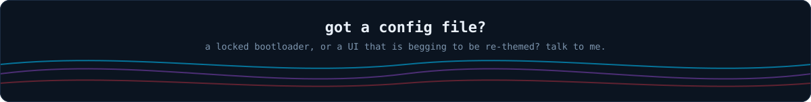

</div>

<!-- The animated furniture on this page (hero, now, pipeline, project cards,
     footer) is hand-written SVG generated by profile/build-assets.py, and lives
     in this repo rather than on someone else's image service -- so the top of
     the profile cannot be broken by a third party's rate limit or outage.
     Re-run it after editing that script:  python3 profile/build-assets.py  -->
